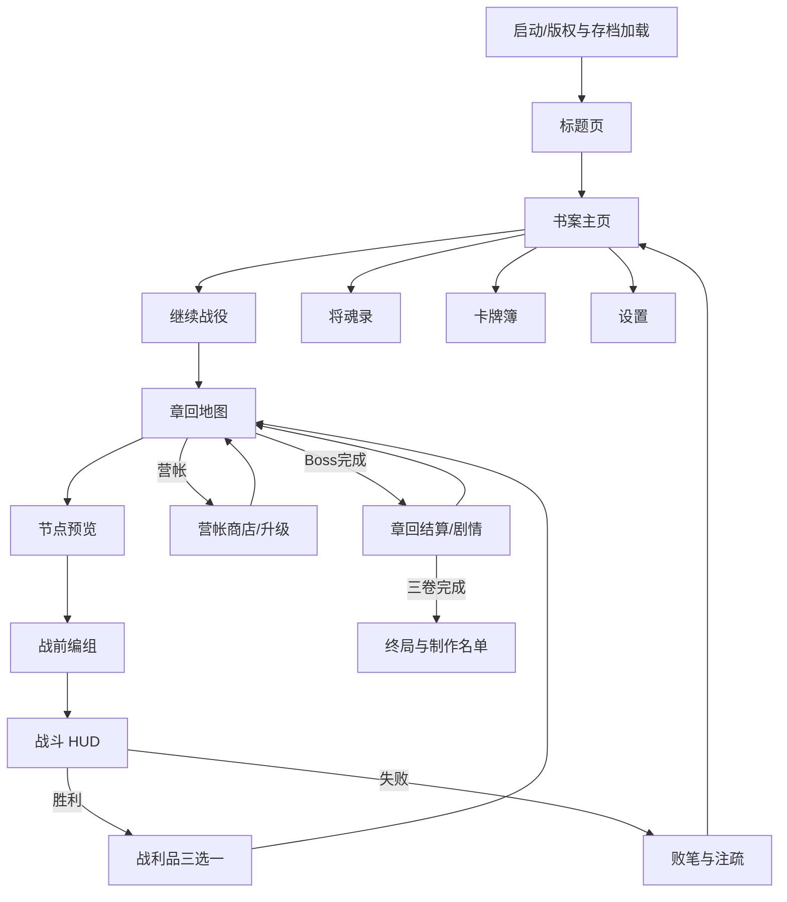
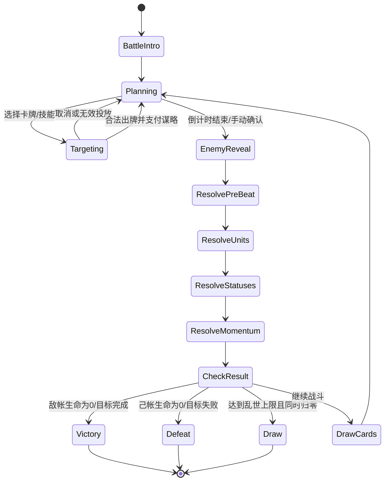
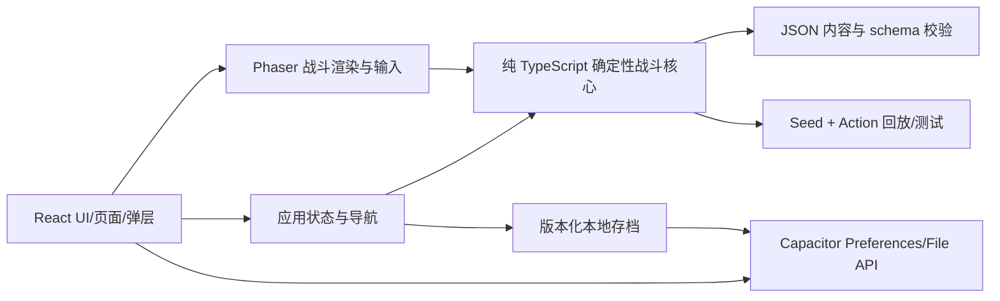

# 《三国：残卷定乾坤》移动端游戏开发文档

> 文档版本：1.0（可开发基线）  
> 关键词：三国演义  
> 目标终端：移动端，竖屏优先  
> 大爆炸流程：第二阶段 10 轮  
> 产品形态：单机、三路军阵、卡组构筑、章回式轻度肉鸽  
> 建议技术栈：React 19 + TypeScript + Vite + Phaser 3（战斗层）+ Capacitor 8（iOS/Android 壳）

---

## 0. 一页结论

《三国：残卷定乾坤》是一款竖屏单机策略游戏。玩家扮演能进入《三国演义》残卷的“司史者”，以刘备、关羽、张飞、赵云、诸葛亮、周瑜六位将魂为核心牌组，在上、中、下三条军阵线上布置武将与兵卒，施放计策，争夺军势，并通过火、风、水、伏兵等连锁反应改写崩坏的章回。

单场战斗 4–6 分钟；单次战役由 6 个节点组成，约 25–35 分钟。战斗采用半实时节拍制：每 3 秒结算一个“军令拍”，玩家可在拍间暂停思考和出牌，兼顾移动端操作、策略深度与可读性。MVP 完成 3 个章回、18 个战役节点、6 名将魂、30 张可用卡、12 类敌军和 3 场 Boss 战，即形成从开局、战斗、奖励、构筑、地图选择到结算的完整闭环。

核心卖点：

1. **一屏三线，单指运筹**：竖屏内完成拖牌、点将、施计，不需要复杂多指操作。
2. **演义名场面变成规则**：草船借箭、火烧赤壁、空城计不是过场，而是可组合机制。
3. **水墨残卷会记住失败**：每次失败形成“朱批”，下次战役获得可控增益并解锁新叙事。
4. **小体量可落地**：以 2D 卡面、头像、特效和数据驱动关卡为主，不依赖大地图、实时联网或大量 3D 资产。

明确不做：开放世界、万人国战、城建计时器、实时 PvP、抽卡养成、装备随机词条海洋、自由移动 3D 战场。

---

# 第一部分：10 轮“大爆炸”全过程

## 1. 第一轮：游戏概念

轮次目标：围绕“三国演义”发散游戏类型、核心体验和玩家目标；目标终端锁定为移动端。

| # | 候选概念 | 类型与核心体验 | 一句话卖点 | 评分 |
|---|---|---|---|---:|
| 1 | 残卷定乾坤 | 章回式轻肉鸽 + 三路卡牌战术 | 进入会崩坏的《三国演义》残卷，用军阵与计策改写名局 | **96** |
| 2 | 赤壁火线 | 物理连锁解谜 | 用风向、船链和火势完成短关卡连锁反应 | 91 |
| 3 | 乱世驿骑 | 竖屏路线规划 | 作为驿骑穿越战区，在限时内传递改变战局的军令 | 86 |
| 4 | 桃园守誓 | 三人小队动作防守 | 切换刘关张守住据点并触发合击 | 83 |
| 5 | 空城心战 | 心理博弈卡牌 | 通过虚实、威慑和情报差逼退强敌 | 90 |
| 6 | 木牛流马 | 机关运输策略 | 规划补给车队穿越蜀道，解决地形与伏兵 | 82 |
| 7 | 铜雀经营录 | 轻经营叙事 | 经营馆舍，招待群雄并收集乱世秘闻 | 78 |
| 8 | 群英列阵 | 自动战棋构筑 | 用武将羁绊和阵型完成短局对抗 | 87 |
| 9 | 华容追猎 | 潜行追逐 | 在雨夜华容道切换追兵与逃亡者视角 | 80 |
| 10 | 青囊济世 | 战地医疗管理 | 以华佗弟子身份在资源压力下救治名将与百姓 | 88 |
| 11 | 舌战群儒 | 对话牌组构筑 | 用论点、典故与气势击破对手立场 | 89 |
| 12 | 黄巾余烬 | 生存防守 | 领导流民营地在战乱与天灾中求生 | 84 |

### 本轮选择：残卷定乾坤

选择理由：最能把人物、计策、地形和章回叙事统一到一套可重复的规则里；竖屏三线战场适合移动端；数据驱动内容便于后续开发扩展；单机轻肉鸽避免联网和重运营成本。

专业字段：

- 游戏名称：《三国：残卷定乾坤》
- 游戏类型：竖屏三路战术卡牌 + 章回式轻度肉鸽
- 目标玩家：喜欢《三国演义》、卡牌构筑和短时策略的 16–40 岁玩家
- 核心体验：在有限军令拍内识破敌阵，以武将、兵种、计策和元素联动逆转战局
- 一句话卖点：把三国名场面变成一手可打出的战术规则
- 玩家目标：修复 3 卷崩坏章回，击败篡改史书的“无名执笔者”，找回真实结局

主视觉 Prompt：

> Mobile portrait game pitch key art for “Three Kingdoms: Chronicle of Shattered Scrolls”, an ancient Chinese strategist standing before a living torn Romance of the Three Kingdoms scroll, three battle lanes flowing from ink, iconic generals emerging as painted spirits, burning Red Cliffs in the distance, clear tactical card game identity, cinematic, no text, 9:16.

---

## 2. 第二轮：视觉风格

已锁定：移动端、《三国：残卷定乾坤》、章回式三路战术卡牌。

| # | 候选风格 | 色彩、材质与 UI 气质 | 评分 |
|---|---|---|---:|
| 1 | 汉简鎏金水墨 | 宣纸黑墨、朱砂批注、鎏金轮廓；卷轴式界面 | **97** |
| 2 | 青绿山水战图 | 石青石绿、古画山川、工笔人物 | 90 |
| 3 | 漆器赤黑 | 黑漆、朱红、铜扣，高对比硬朗界面 | 92 |
| 4 | 皮影烽烟 | 半透明皮影角色与暖色灯幕 | 84 |
| 5 | 竹简剪纸 | 剪纸剪影与竹简纹理，亲和轻量 | 82 |
| 6 | 泼墨漫画 | 粗笔速度线、夸张武将表情、强动势 | 89 |
| 7 | 低多边形汉风 | 几何战场和玩具化兵阵，开发成本低 | 80 |
| 8 | 铜版志怪 | 冷灰蚀刻、妖异残卷、密集纹线 | 87 |
| 9 | 绢本工笔 | 精致绢本、矿物色、收藏卡感强 | 91 |
| 10 | 简牍像素 | 像素兵阵叠加古籍 UI，复古清晰 | 78 |
| 11 | 水墨霓虹 | 墨色与青紫发光融合，现代潮流 | 83 |
| 12 | 白描留金 | 大面积留白、细线人物、局部金色 | 88 |

### 本轮选择：汉简鎏金水墨

选择理由：与“残卷、朱批、改史”的叙事完全同构；黑、朱、金三色能建立清楚的敌我、危险和奖励层级；宣纸与墨迹能用 2D shader、粒子和序列帧实现，成本可控；小屏上仍有强识别度。

专业字段：

- 风格名称：汉简鎏金水墨
- 色彩基调：宣纸米白为底，墨黑为结构，朱砂红表示敌意/伤害，鎏金表示可交互/稀有，青灰表示水与控制
- 材质语言：纸纤维、干湿墨边、漆器面板、竹简分隔、金箔裂纹
- 角色轮廓：武将采用半身工笔卡面，兵卒采用高辨识墨影；武器、冠帽、披风形成唯一剪影
- 场景气质：像一卷正在燃烧、被批改且会活动的古代战图
- UI 气质：卷轴层级、朱批反馈、金线按钮；装饰克制，战斗信息优先

视觉 Prompt：

> Mobile portrait Three Kingdoms tactical card game art direction, Han dynasty bamboo-slip and gilded ink-wash aesthetic, warm xuan paper, dry black ink, cinnabar red annotations, restrained cracked gold foil, elegant general portraits, readable three-lane battlefield, lacquer UI panels, premium 2D game mockup, no modern neon, no text, 9:16.

### 全局视觉合同

- 后续所有角色、地图、关卡、系统和 UI 不得切换为写实 3D、日漫、欧美油画或赛博风。
- 正文最小字号按 375×812 逻辑分辨率不得低于 14 px；关键战斗数字不低于 18 px。
- 颜色不能是唯一信息载体：阵营同时用轮廓方向、印章图标和形状区分。
- 同屏最多 3 种高亮色；金色只用于可操作与高价值反馈，避免滥用。

---

## 3. 第三轮：核心玩法

已锁定视觉风格：汉简鎏金水墨。该风格从本轮起贯穿所有图片与 UI。

| # | 候选玩法 | 核心操作、循环与爽点 | 评分 |
|---|---|---|---:|
| 1 | 三路军阵卡组 | 拖牌入三路，节拍结算，武将与计策制造连锁 | **98** |
| 2 | 火势连锁棋盘 | 点燃、借风、断链，让火沿格子传播 | 93 |
| 3 | 虚实军令 | 同时布置真假军令，以情报差欺骗 AI | 88 |
| 4 | 将星轮换 | 三将共享冷却，切换前后阵触发合击 | 87 |
| 5 | 舌战攻心 | 论点牌攻击立场，威望与逻辑双资源 | 86 |
| 6 | 单指战棋 | 在小型六角棋盘拖动将领夹击 | 84 |
| 7 | 军粮压线 | 护送补给并决定前线资源分配 | 83 |
| 8 | 伏兵拼图 | 预先放置伏兵，开战后观看连锁执行 | 89 |
| 9 | 章回骰策 | 骰子分配给武、智、德行动槽 | 80 |
| 10 | 锦囊堆叠 | 计策按顺序入栈，可被反计与改写 | 92 |
| 11 | 士气节拍 | 跟随鼓点下令，精准拍获得士气加成 | 77 |
| 12 | 阵图自动战斗 | 战前构筑阵图，战中有限干预 | 85 |

### 本轮选择：三路军阵卡组

选择理由：同时保留即时战局变化与卡组策略；三路结构在竖屏上天然清楚；计策、将领、兵种和赤壁火势均能共用一套数据模型；4–6 分钟单局符合移动场景。

专业字段：

- 核心操作：点击选牌、拖拽至上/中/下路、点击己方将领释放将技、长按查看规则
- 核心循环：选择战役节点 → 配置 12 张牌 → 三路战斗 → 选择战利品/事件 → 强化牌组 → Boss → 章回结算
- 成长方式：局内获得军功升级卡牌；局外以“史墨”解锁新卡与将魂，但不提供永久纯数值碾压
- 失败条件：主帐生命归零，或特殊关卡目标失败；胜利通常为敌方主帐归零
- 爽点来源：预判敌方军令后，以火借风、草船借箭、伏兵断粮等连锁在一个军令拍内反转三路
- 多人/单人定位：MVP 纯单机；不为 PvP 平衡牺牲单机表现

玩法 Prompt：

> Readable mobile portrait gameplay mockup for a Three Kingdoms three-lane tactical deckbuilder, gilded Chinese ink-wash style, enemy army at top and player command tent at bottom, three vertical battle lanes, general cards and stratagem cards in a bottom hand, fire and wind combo spreading between lanes, clear touch targets, xuan paper and cinnabar annotations, no text, 9:16.

---

## 4. 第四轮：世界观剧情

| # | 候选剧情框架 | 玩家身份、谜团与冲突 | 评分 |
|---|---|---|---:|
| 1 | 残卷改史 | 司史者进入崩坏章回，对抗删改人物因果的无名执笔者 | **97** |
| 2 | 赤壁不燃 | 赤壁大火从史书消失，三方追查被窃走的东南风 | 93 |
| 3 | 将星失名 | 群雄逐渐忘记姓名与旧誓，玩家替他们找回“名” | 90 |
| 4 | 曹操梦华容 | 全篇发生在曹操败走时的一场层叠梦境 | 88 |
| 5 | 隆中错策 | 隆中对被人改写，天下沿陌生时间线分裂 | 91 |
| 6 | 玉玺十二裂 | 传国玉玺化为十二权柄，引发新阵营战争 | 84 |
| 7 | 黄天回响 | 黄巾余部发现能预言王朝结局的天书 | 85 |
| 8 | 铜雀藏书 | 铜雀台地下保存所有未发生的历史 | 89 |
| 9 | 七擒第八局 | 孟获发现七擒之后还有被抹去的一次对决 | 83 |
| 10 | 借箭者无归 | 草船归来时船上只有箭，没有诸葛亮 | 92 |
| 11 | 桃园第四人 | 桃园誓词中出现一个无人记得的名字 | 94 |
| 12 | 空城真兵 | 空城计中的幻兵开始在现实中杀人 | 87 |

### 本轮选择：残卷改史

选择理由：为反复挑战、路线分歧、失败继承和章节扩展提供自然解释；既可尊重原著名场面，又允许玩法驱动的“如果”；最终反派不绑定某一历史阵营，避免把某方简单脸谱化。

专业字段：

- 世界设定：《三国演义》是一卷由无数读者记忆维系的“演义原卷”。名场面被抹去后，对应人物将失去动机，天下变成没有因果的战阵循环
- 玩家身份：无名书吏“司史者”，可进入残页，以朱批暂时固定人物命运
- 主线目标：修复“桃园誓”“长坂魂”“赤壁火”三卷，收集三枚原文印，进入空白卷心
- 核心冲突：无名执笔者认为英雄叙事只会让战争循环，试图删除所有名字与因果；玩家必须证明“记住选择”不同于“歌颂战争”
- 阵营关系：魏、蜀、吴不是善恶阵营；每卷中可因共同阻止失忆而临时合作，也会因各自目标冲突
- 结局方向：正史结局（修复原卷）、留白结局（允许新注）、焚卷结局（终止循环）；MVP 实装正史结局，其余留接口

叙事 Prompt：

> Narrative key art for a mobile Three Kingdoms game in gilded Han ink-wash style, a nameless archive scribe inside a gigantic torn living scroll, Liu Bei, Cao Cao and Sun Quan memories fading into blank paper, a faceless editor painting over history with black ink, cinnabar seals preserving the Battle of Red Cliffs, tragic yet hopeful, no text, 9:16.

---

## 5. 第五轮：角色体系

| # | 候选角色方向 | 角色关系与功能 | 评分 |
|---|---|---|---:|
| 1 | 司史者与六将魂 | 原创玩家代理串联刘关张、赵云、诸葛亮、周瑜六种流派 | **96** |
| 2 | 桃园三人组 | 刘关张共享誓约资源，关系集中但流派偏少 | 89 |
| 3 | 卧龙公瑾双谋 | 诸葛亮与周瑜亦敌亦友，强化计策玩法 | 93 |
| 4 | 魏蜀吴三主 | 曹操、刘备、孙权三套领袖路线 | 91 |
| 5 | 五虎残影 | 五虎将记忆碎片化，逐一找回身份 | 87 |
| 6 | 赤壁群像 | 曹操、周瑜、诸葛亮、黄盖、甘宁、鲁肃群像 | 92 |
| 7 | 无名小卒 | 普通士兵在英雄叙事夹缝中生存 | 90 |
| 8 | 女史执卷 | 蔡文姬、貂蝉、孙尚香等从旁观者改写叙事 | 88 |
| 9 | 谋士议会 | 郭嘉、贾诩、诸葛亮、司马懿以计策相克 | 86 |
| 10 | 反派执笔团 | 多名被遗忘者共同删改原卷 | 84 |
| 11 | 英魂兵器谱 | 将魂寄宿武器，角色通过兵器切换 | 80 |
| 12 | 三姓家臣录 | 以吕布为中心探索名与忠诚 | 85 |

### 本轮选择：司史者与六将魂

选择理由：原创司史者让玩家拥有自己的位置；六将魂覆盖守、突、压、援、控、燃六种玩法；人物知名度高、首发内容规模可控，并为曹操、孙权等后续角色保留空间。

首发角色：

| 角色 | 身份/性格 | 技能定位 | 与主角关系 | 成长/反转 |
|---|---|---|---|---|
| 司史者（玩家） | 无名书吏；克制、好奇、畏惧替别人决定命运 | 不上阵；携带 1 枚“朱批”修改一次结算 | 从记录者变成愿意承担选择后果的人 | 发现自己是被执笔者删去的最后一名读者 |
| 刘备 | 仁德领袖；温和但意志极强 | 守势、治疗、召集义军、跨路支援 | 认可司史者保护百姓的选择 | 直面“仁德是否也会驱使他人牺牲” |
| 关羽 | 誓义武将；骄傲、守信 | 单路斩将、蓄势爆发、过量伤害穿透 | 因主角能否守诺而改变信任 | 从只守旧誓到理解当下之义 |
| 张飞 | 猛将；暴烈、敏锐、爱憎分明 | 压线、震慑、低血增伤 | 起初怀疑书吏怯懦，后成为直接保护者 | 学会把怒气用来守护而非失控 |
| 赵云 | 护卫；冷静、行动优先 | 跨路救援、护送、反击 | 最早相信主角行动价值的人 | 接受“并非所有人都能被救下” |
| 诸葛亮 | 军师；从容、审慎、背负预见 | 风向、借箭、费用调度、延迟计策 | 把主角视为不可计算的变量 | 承认最优解之外仍有人的选择 |
| 周瑜 | 都督；敏锐、自尊、重全局 | 点燃、连环、火势扩散、节奏爆发 | 与主角合作但警惕蜀方叙事垄断 | 从证明自己转向共同保存赤壁真相 |

主要反派：

- 无名执笔者：没有五官，披由删改痕组成的长衣。其能力是把卡牌名称擦除，使其只剩基础数值。动机不是称霸，而是停止英雄故事对战争的美化。
- 白卒：被删去姓名与阵营的墨兵，能复制玩家上一拍打出的牌。
- 涂将：Boss 精英，将原著人物能力涂黑后扭曲使用。

角色 Prompt：

> Character lineup sheet for a mobile Three Kingdoms tactical card game, gilded Han ink-wash style on xuan paper, the nameless Chronicle Scribe plus Liu Bei, Guan Yu, Zhang Fei, Zhao Yun, Zhuge Liang and Zhou Yu, distinct silhouettes and weapons, lacquer-black, cinnabar and cracked gold accents, expressive half-body card portraits, faceless ink editor antagonist behind them, no map, no UI, no text.

---

## 6. 第六轮：地图区域

| # | 候选地图结构 | 地形、机制与事件 | 评分 |
|---|---|---|---:|
| 1 | 九章战图 | 卷轴节点地图，三卷各六节点，路线可分岔重组 | **97** |
| 2 | 汉水三路 | 一条沿江纵向地图，水位改变路线 | 89 |
| 3 | 破碎十三州 | 拼合州郡碎片构成随机地图 | 88 |
| 4 | 赤壁连舰 | 船只本身就是可切换的战场节点 | 93 |
| 5 | 长坂逃亡线 | 追击压力持续推进，不能回头 | 86 |
| 6 | 竹简迷宫 | 滑动竹简改变道路连接 | 84 |
| 7 | 三都营帐 | 成都、许都、建业作为三大枢纽 | 82 |
| 8 | 墨河逆流 | 沿墨河逆行，失败污染后续区域 | 87 |
| 9 | 华容岔路 | 每次选择义、利、势三类路径 | 90 |
| 10 | 将星天盘 | 星图式节点，角色关系决定路径 | 85 |
| 11 | 驿道补给网 | 控制粮道解锁战斗优势 | 83 |
| 12 | 空白卷心 | 从有字区域深入逐渐空白的中心 | 91 |

### 本轮选择：九章战图

选择理由：节点式地图最适合轻肉鸽和移动端；可复用战斗场景而不显得内容重复；三卷对应清楚的 MVP 里程碑；以后新增章回只需增加数据、卡面和少量机制资产。

MVP 区域：

| 区域 | 视觉主题 | 主要机制 | 敌人生态 | 资源与事件 | 区域 Boss |
|---|---|---|---|---|---|
| 第一卷·桃园残誓 | 春雨、桃花、黄巾营火、破损誓书 | 召集义军、保护百姓、誓约标记 | 黄巾散兵、乱军、白卒 | 仁德印、义军牌、是否救援支线 | 涂将·程远志 |
| 第二卷·长坂失魂 | 阴雨长坡、断桥、流民车队、墨潮追兵 | 护送单位、追击倒计时、跨路救援 | 曹军骑兵、弓弩阵、失名骑 | 龙胆印、救援牌、阿斗记忆事件 | 无名虎豹骑 |
| 第三卷·赤壁无火 | 长江夜雾、连环战船、祭风台、火纹残页 | 潮汐、风向、湿润/点燃、火势跨路 | 水军、盾船、白卒谋士 | 东风印、火计牌、借箭事件 | 执笔者·灭火之手 |

地图 Prompt：

> Stylized mobile portrait world map for a Three Kingdoms chapter-based roguelite, a vertical living scroll divided into Peach Garden, Changban slopes and Red Cliffs river regions, six branching nodes per chapter, landmarks painted in gilded Han ink wash, cinnabar route seals, black ink corruption spreading toward a blank scroll center, readable navigation, no detailed level UI, no text, 9:16.

---

## 7. 第七轮：关卡设计

| # | 候选关卡框架 | 目标、路线与压力结构 | 评分 |
|---|---|---|---:|
| 1 | 章回六节点 | 每卷 4 战 + 1 事件/营帐 + 1 Boss，短而完整 | **98** |
| 2 | 三幕单战场 | 一场战斗连续三阶段变阵 | 90 |
| 3 | 名场面挑战簿 | 每关独立还原一个经典桥段 | 91 |
| 4 | 护送追击链 | 生命与距离贯穿整卷 | 86 |
| 5 | 军令谜题关 | 固定手牌，在限定拍数内求解 | 93 |
| 6 | 无尽华容道 | 路线越走越难的无尽模式 | 82 |
| 7 | 双线同时战 | 两个战场来回切换 | 80 |
| 8 | 昼夜围城 | 防守波次并在间歇建设 | 83 |
| 9 | 火船倒计时 | 倒计时结束前完成连锁点燃 | 94 |
| 10 | 将领单挑场 | 缩为一路，强调时机与反制 | 87 |
| 11 | 伏兵侦察局 | 先侦查问号格，再决定进军路线 | 89 |
| 12 | 朱批改题 | 玩家可改写一条关卡规则 | 92 |

### 本轮选择：章回六节点

选择理由：形成稳定内容模板，方便教学、节奏控制、QA 和追加内容；把“军令谜题”“火船倒计时”“朱批改题”作为节点修饰词吸收，而不是另立互斥模式。

每卷固定结构：

1. 普通战：教学或复习本卷基础机制。
2. 分岔：普通战/事件二选一。
3. 精英战：加入敌方将领和强化规则。
4. 营帐：删牌、升级、治疗或招募将魂。
5. 前哨战：组合检验本卷机制，Boss 铺垫。
6. Boss：三阶段或两阶段规则变化，结束后获得原文印。

首发 18 节点详表：

| ID | 节点 | 类型 | 目标/核心规则 | 首通奖励 |
|---|---|---|---|---|
| C1-01 | 涿郡乱火 | 普通 | 8 拍内击破中路；教学出兵、交战、主帐 | 义勇兵 |
| C1-02A | 桃园护誓 | 护送 | 让誓书单位存活 6 拍 | 桃园结义 |
| C1-02B | 饥民营 | 事件 | 失去 8 点本卷生命换取两张义军牌 | 史墨 20 |
| C1-03 | 黄巾风阵 | 精英 | 敌方每 3 拍换路；要求预判和拦截 | 刘备试用 |
| C1-04 | 桑树营帐 | 营帐 | 升级 1 张牌或删除 1 张基础牌 | 卡牌升级 |
| C1-05 | 誓文被涂 | 前哨 | 随机一张牌失去名称；用类别协同过关 | 朱批 +1 |
| C1-06 | 斩断无名旗 | Boss | 程远志二阶段：召卒 → 涂抹誓约 | 仁德原文印 |
| C2-01 | 当阳追骑 | 普通 | 敌骑每拍推进；教学护送与跨路 | 轻骑拦截 |
| C2-02A | 百姓渡口 | 护送 | 3 个百姓单位至少 2 个抵达上方 | 仁心相护 |
| C2-02B | 断桥疑兵 | 事件战 | 张飞在一路制造高威慑，逼退而非击杀 | 当阳一喝 |
| C2-03 | 七进墨潮 | 精英 | 赵云每次换路积累龙胆，救出记忆 | 赵云解锁 |
| C2-04 | 古井营帐 | 营帐 | 恢复生命，或牺牲恢复换稀有牌 | 史墨/治疗 |
| C2-05 | 阿斗无名 | 前哨 | 携带记忆单位抵达主帐，敌方持续复制牌 | 朱批 +1 |
| C2-06 | 虎豹无主 | Boss | 骑阵冲锋 → 三路包围 → 无名复制 | 龙胆原文印 |
| C3-01 | 草船借箭 | 谜题 | 湿润状态下承受箭雨，累计借箭 12 层 | 草船借箭 |
| C3-02A | 苦肉残痕 | 事件 | 选择承受当前生命 20% 换取火攻组件 | 苦肉计 |
| C3-02B | 铁索连舟 | 普通 | 敌方连环使伤害扩散，也会传播火势 | 连环锁 |
| C3-03 | 东风祭台 | 精英 | 保卫祭台 5 拍，控制风向后反攻 | 诸葛亮解锁 |
| C3-04 | 水寨营帐 | 营帐 | 招募周瑜或升级火系牌 | 周瑜试用 |
| C3-05 | 火船夜渡 | 前哨 | 10 拍倒计时内让点燃跨越三路 | 东风 |
| C3-06 | 赤壁无火 | Boss | 灭火之手依次封名、降雨、吞火；玩家重建火链 | 东风原文印、结局 |

> 注：MVP 地图每卷显示 6 个访问位，分岔节点只会出现 A/B 之一，因此内容表有 21 个定义、一次完整通关访问 18 个。

关卡 Prompt：

> Mobile game level design board in gilded Chinese ink-wash style, a six-node Three Kingdoms chapter flow with normal battle, branching event, elite, camp, vanguard and multi-phase boss, readable three-lane combat diagrams, patrol arrows, rewards and cinnabar trigger seals, xuan paper, no tiny text, portrait layout.

---

## 8. 第八轮：系统数值

| # | 候选系统框架 | 规则、成长和决策 | 评分 |
|---|---|---|---:|
| 1 | 军势谋略双构筑 | 部队争军势、计策花谋略，将魂改变规则 | **98** |
| 2 | 五德将魂树 | 仁义礼智信五条永久成长线 | 86 |
| 3 | 兵粮压力经济 | 所有出牌消耗可被断粮的兵粮 | 89 |
| 4 | 天时地利人和 | 三类资源组合触发大计 | 92 |
| 5 | 锦囊反制栈 | 计策可被连续反制和反反制 | 88 |
| 6 | 誓约羁绊 | 特定人物连续出场累积誓约 | 91 |
| 7 | 史墨注疏 | 失败生成注疏，改变下次规则 | 94 |
| 8 | 武器铸印 | 青龙偃月刀等名器作为流派核心 | 84 |
| 9 | 爵位声望 | 阵营声望解锁路线和价格 | 80 |
| 10 | 军阵克制环 | 枪、骑、弓三角克制 | 87 |
| 11 | 名场面成就 | 特定条件重演典故，获得收藏页 | 90 |
| 12 | 难度朱批 | 玩家主动选择强化敌人的负面批注 | 93 |

### 本轮选择：军势谋略双构筑

并入辅助系统：史墨注疏、誓约羁绊、难度朱批。选择理由：双资源让部队牌与计策牌各有清楚位置；局内、局外成长边界明确；数值可用少量变量完成深度，不需要复杂装备词条。

#### 8.1 战斗基础数值

- 主帐生命：玩家 30，普通敌 24，精英 30，Boss 45/55/65。
- 单局最大军令拍：普通 12，精英 15，Boss 18；到上限后双方主帐每拍受 3 点“乱世”伤害。
- 军令拍：3 秒实时倒计时；打开选牌详情或首次进入新机制时暂停。设置中可切换“每拍手动确认”的全策略模式。
- 起始手牌：5；牌组：12；每拍开始抽 1；手牌上限 7；弃牌堆空时洗牌。
- 谋略：初始 2/上限 5；每拍恢复 2。部队通常消耗 1–3，计策通常消耗 1–2。
- 军势：每路默认 -9 至 +9，关卡可调整门槛与破阵伤害。首个教学战为 ±6、破阵 10 伤且一次破阵获胜；第一章后续战斗按“两次、三次、四次破阵”递增，正式关卡逐步回到 ±9。结算后双方战力差转化为军势，破阵后军势部分重置。
- 单位字段：cost、attack、guard、speed、tags、onDeploy、onBeat、onDefeat。
- 伤害顺序：护盾 → 守备 → 生命；MVP 单位不保留跨拍生命，守备是该拍承伤能力，拍末双方单位结算后离场或进入持续区。

#### 8.2 状态规则

| 状态 | 规则 | 上限/持续 |
|---|---|---|
| 点燃 | 每拍结算前受层数伤害；受“风”时向相邻一路复制一半层数（向上取整） | 6 层，2 拍 |
| 湿润 | 清除点燃；下一次受到雷/箭类效果 +1 | 1 层，2 拍 |
| 伏兵 | 该单位本拍不计入战力，敌方部署后显形并 +2 攻 | 1 次 |
| 威慑 | 敌方该路下一张部队牌费用 +1 | 最多 2 层 |
| 誓约 | 同一拍打出两名结义标签角色，双方 +1 攻并获得 1 护盾 | 每拍 1 次 |
| 借箭 | 每承受一次箭类攻击获得 1 层；12 层可生成 0 费“万箭齐发” | 12 层 |
| 无名 | 卡牌专有技能失效，只保留费用、攻守与类别 | 1–2 拍 |

#### 8.3 首发牌组（30 张）

基础牌 12 张：义勇兵、长枪兵、弓手、轻骑、盾卒、斥候各 2 张。  
将魂牌 6 张：刘备、关羽、张飞、赵云、诸葛亮、周瑜。  
计策牌 12 张：桃园结义、仁心相护、当阳一喝、单骑救主、草船借箭、东风、火攻、连环锁、伏兵、疑兵、断粮、万箭齐发。

标准数值示例：

| 牌 | 费用 | 基础值 | 效果 |
|---|---:|---|---|
| 义勇兵 | 1 | 攻 2 / 守 1 | 若本拍此路已有将魂，+1 攻 |
| 长枪兵 | 1 | 攻 2 / 守 2 | 对骑兵 +2 攻 |
| 轻骑 | 2 | 攻 4 / 守 1 | 可在部署后改换相邻一路一次 |
| 刘备 | 3 | 攻 2 / 守 5 | 部署：相邻两路各召 1/1 义勇兵 |
| 关羽 | 3 | 攻 6 / 守 2 | 若此路军势≤0，伤害穿透 2 |
| 张飞 | 3 | 攻 5 / 守 3 | 部署：施加 1 威慑；己帐≤15 时再 +2 攻 |
| 赵云 | 2 | 攻 3 / 守 3 | 可移至任一路；目标有护送单位时获得反击 2 |
| 诸葛亮 | 3 | 攻 1 / 守 4 | 部署：选择下一拍风向；首张计策费用 -1 |
| 周瑜 | 3 | 攻 3 / 守 3 | 本路施加点燃时额外 +1 层 |
| 火攻 | 2 | — | 目标路 2 层点燃；若有风则 +1 |
| 东风 | 1 | — | 风向持续 2 拍；下一张火系计策费用 -1 |
| 草船借箭 | 1 | — | 本路湿润；本拍箭伤转为借箭层数 |

升级规则：每张牌只有 A/B 两种升级，避免无限数值膨胀。例如火攻 A 为层数 +1，B 为命中湿润目标时扩散至相邻路；一局只能选择一种。

#### 8.4 局外成长

- 史墨：通关节点获得，用于解锁新牌、新将魂和图鉴，不直接增加主帐基础生命。
- 朱批：每次战役最多携带 1 枚；允许重抽一次战利品、改写一次敌方军令，或撤回一次误操作。默认每卷恢复 1。
- 注疏：失败后从 3 条中选 1 条仅对下一次战役生效，如“起始多抽 1 张”或“Boss 生命 -5%”；最多保留 1 条。
- 难度朱批：通关后开放。玩家选择敌方 +10% 生命、精英增加词缀等负面条件，提高史墨收益；不属于 MVP 必须项。

#### 8.5 经济、掉落与难度

- 一局内货币为军功，战斗 25、精英 45、事件 0–30、Boss 80。
- 营帐：升级 40，删牌 60，治疗 30，购买普通牌 35/稀有牌 65。
- 战利品：每场战斗三选一，权重普通 70%、稀有 25%、名场面 5%；同一张最多 2 份。
- AI 只读取当前公开盘面和关卡脚本，不读取玩家手牌。
- 难度目标：新玩家首卷首次通关率 60–70%；三卷首次完整通关率 20–30%；熟练玩家稳定通关率 70% 以上。

系统 Prompt：

> Mobile game system design board for a Three Kingdoms roguelite deckbuilder, gilded Han ink-wash interface, dual resource loop of military momentum and stratagem points, twelve-card deck, six general spirits, branching card upgrades, history-ink meta unlocks and failure annotations, clear diagrams and large touch-friendly components, xuan paper, cinnabar and gold, portrait layout, no illegible tiny text.

---

## 9. 第九轮：UI 页面

| # | 候选 UI 方向 | 页面与交互策略 | 评分 |
|---|---|---|---:|
| 1 | 一屏战阵·卷轴营帐 | 战斗全在一屏，非战斗页采用纵向卷轴和底部抽屉 | **98** |
| 2 | 竹简多标签 | 所有功能做成横向竹简标签 | 85 |
| 3 | 地图即首页 | 首屏直接进入章回节点地图 | 91 |
| 4 | 将魂桌案 | 以书案物件作为功能入口 | 88 |
| 5 | 极简无框水墨 | 大量留白与手势操作，沉浸但发现性弱 | 82 |
| 6 | 战报信息流 | 像批注信息流一样展示进程 | 83 |
| 7 | 卡牌收藏簿 | 以图鉴为核心导航 | 86 |
| 8 | 漆器仪表盘 | 高对比黑漆面板，信息强但稍重 | 89 |
| 9 | 双层战场 | 战斗和手牌可上下滑动切换 | 79 |
| 10 | 单手扇形手牌 | 手牌扇形围绕右下拇指区 | 92 |
| 11 | 朱批快捷环 | 长按打开计策轮盘 | 84 |
| 12 | 动态章回书 | 翻页动画贯穿所有页面 | 87 |

### 本轮选择：一屏战阵·卷轴营帐

吸收“单手扇形手牌”的拇指热区设计。选择理由：战斗信息不分页，避免关键状态丢失；非战斗页面可用 React 常规布局高效开发；视觉上仍保持卷轴叙事。

#### 9.1 页面流



#### 9.2 关键页面规格

| 页面 | 页面目标 | 核心控件 | 主要状态 | 移动端适配 |
|---|---|---|---|---|
| 标题页 | 新游戏/继续 | 继续、重开、设置 | 无存档、有存档、加载失败 | 主按钮置于下半屏拇指区 |
| 书案主页 | 功能总入口 | 残卷、将魂录、卡牌簿、设置 | 新解锁红点、存档同步状态 | 4 个大入口，不用汉堡菜单 |
| 章回地图 | 选择下一节点 | 节点、路线、生命/军功/牌组抽屉 | 可达、锁定、完成、精英、Boss | 纵向滚动；当前节点自动居中 |
| 战前编组 | 组成 12 牌 | 牌组槽、筛选、卡详情、开始 | 牌数不足、超上限、冲突提示 | 点按加入，长按详情，支持一键推荐 |
| 战斗 HUD | 完成所有核心操作 | 三路、手牌、谋略、军势、暂停、将技 | 选牌、拖拽、目标、结算、胜负 | 44×44 pt 最小热区；危险区避开系统手势 |
| 战利品 | 三选一并看见影响 | 3 张奖励卡、跳过、牌组预览 | 普通、稀有、新解锁 | 卡片可横滑，但三项标题同时可见 |
| 营帐 | 升级/删牌/恢复 | 4 个服务、军功、确认弹层 | 买得起/不足、已使用 | 单列列表，不做密集商店网格 |
| 角色/卡牌详情 | 理解规则与背景 | 卡面、数值、升级分支、典故 | 已解锁、未解锁、升级预览 | 内容纵向滚动，规则词可点击解释 |
| 章回结算 | 展示结果并推进叙事 | 战绩、解锁、下一卷 | 首通、重复通关、终章 | 动画可跳过，奖励不依赖动画完成 |
| 设置 | 可访问性和系统选项 | 音量、震动、速度、手动拍、字体、色弱 | 默认/修改/恢复 | 所有修改即时保存 |

#### 9.3 战斗 HUD 布局（375×812 逻辑像素基准）

- 顶部 0–72：敌主帐生命、Boss 阶段、暂停。
- 战场 72–560：三条纵向军阵，每路宽约 105，中间留 6–8；敌军自上向下，己方自下向上。
- 状态条 560–612：三路军势、当前军令拍倒计时、风向/潮汐。
- 手牌 612–752：最多显示 5 张主卡，其余水平滑动；选中卡抬升并显示有效投放路。
- 底部 752–812 + 安全区：谋略、抽/弃牌数、朱批、将魂技能。
- 拖牌松手区容错：有效路边界外扩 12 px；拖到无效区自动回手，不扣资源。
- 所有战斗动作支持点击卡 → 点击路的替代操作。

UI Prompt：

> Production-ready mobile portrait battle HUD mockup for a Three Kingdoms three-lane tactical deckbuilder, 375 by 812 layout, enemy command at top, three clear vertical lanes, momentum markers, five large cards in bottom thumb reach, stratagem resource and undo seal, gilded Han ink-wash visual language, warm xuan paper, black lacquer, cinnabar danger, gold interactions, readable accessibility-first hierarchy, no desktop panels, 9:16.

---

## 10. 第十轮：最终方案

| # | 最终交付候选 | 收束重点 | 评分 |
|---|---|---|---:|
| 1 | 三国：残卷定乾坤·可玩基线 | 3 卷、6 将魂、30 牌、完整战役闭环 | **99** |
| 2 | 赤壁垂直切片版 | 只做赤壁一卷，极致打磨火势 | 95 |
| 3 | 名场面挑战版 | 取消肉鸽地图，做 12 个固定谜题 | 90 |
| 4 | 将魂收藏版 | 强化角色收集与养成 | 84 |
| 5 | 深度构筑版 | 扩展至 80 张牌和 12 将魂 | 80 |
| 6 | 叙事互动版 | 减少战斗、增加分支对话 | 86 |
| 7 | 极简试玩版 | 1 卷、3 将魂、18 牌 | 93 |
| 8 | 买断完整版 | 6 卷、无内购、约 8 小时内容 | 88 |
| 9 | 每日挑战版 | 加入种子关卡和排行榜 | 82 |
| 10 | 双端同步版 | 移动与网页共享存档 | 78 |
| 11 | 动态难度版 | 根据行为实时调整敌方脚本 | 81 |
| 12 | UGC 章回版 | 玩家编辑战役与分享 | 76 |

### 最终选择：三国：残卷定乾坤·可玩基线

选择理由：相比只做一卷的演示切片，三卷已经能证明多区域内容管线和终局；相比“大而全”版本，30 张牌、6 将魂仍适合小团队分阶段实现；所有必需模块均有确定数量和验收口径。

专业字段：

- 游戏定位：移动端竖屏、单机、4–6 分钟短战斗、25–35 分钟单次战役的三国战术构筑游戏
- 核心卖点：三路军势、演义计策连锁、残卷失败注疏、汉简鎏金水墨
- MVP 范围：3 卷主线、18 个访问节点、6 将魂、30 牌、12 普通/精英敌、3 Boss、10 个关键页面、本地存档
- 开发优先级：先做纯色块战斗闭环，再做赤壁垂直切片，再扩为三卷，最后补美术、叙事和可访问性
- 评审重点：单指可操作性、战斗状态可读性、三路决策是否真实、火风水连锁是否有爽点、内容是否完全数据驱动

最终总览 Prompt：

> Complete game design handoff overview for “Three Kingdoms: Chronicle of Shattered Scrolls”, mobile portrait single-player three-lane tactical deckbuilder, showing concept key art, gilded Han ink-wash style guide, battle loop, shattered-scroll story, seven-character lineup, three chapter map, six-node level template, dual-resource card system and production-ready mobile UI, coherent review board, xuan paper, cinnabar, black lacquer and cracked gold, no illegible text.

---

# 第二部分：开发实施规格

## 11. 产品边界与发行假设

- 平台：iOS 16+、Android 10+；竖屏锁定。
- 屏幕：以 375×812 逻辑像素设计，覆盖 320–430 宽度和安全区。
- 联网：MVP 不要求账号与服务端；首次安装后可完全离线游玩。
- 商业模式：MVP 无广告、无内购。若商业发行，优先一次性买断或纯外观扩展，不出售战斗数值。
- 目标包体：首包 ≤250 MB；音频和插画采用压缩格式。
- 性能：主流中端机 60 FPS；低性能模式 30 FPS；战斗输入到反馈 <100 ms。
- 单局可恢复：应用切后台或被系统杀死后，回到最近一个军令拍开始前。

## 12. 核心战斗状态机



确定性结算顺序：

1. 锁定本拍玩家动作与敌方军令。
2. 处理“拍前”效果：风向、潮汐、费用改变。
3. 按 speed 从高到低部署；同速时玩家先手，Boss 特例由脚本显式声明。
4. 处理部署效果与反应队列；每个效果必须有 sourceId，防止无限自触发。
5. 各路计算单位攻守和克制，结算单位战斗。
6. 处理点燃、湿润、借箭、无名等状态。
7. 计算三路军势与主帐伤害。
8. 检查胜负与关卡特殊目标。
9. 清理临时单位/状态，抽牌，进入下一拍。

反应队列上限：单拍 64 个 effect；超过时停止新增并写错误日志。相同 effectId + sourceId + targetId 单拍最多触发一次，除非配置 `repeatable: true`。

## 13. 敌人和 AI

MVP 敌军类别 12 个：黄巾散兵、黄巾术士、乱军盾卒、白卒、弓弩阵、轻骑、虎豹骑、护粮队、水军、盾船、白卒谋士、涂将先锋。

敌方 AI 使用可预览的“军令意图”而非自由搜索：

```ts
type EnemyIntent = {
  beat: number;
  lane: 0 | 1 | 2 | "weakest" | "strongest";
  actionId: string;
  telegraph: "full" | "category" | "hidden";
  condition?: RuleExpression;
  fallbackActionId?: string;
};
```

- 普通难度：完整显示下拍敌人类别、目标路和大致战力。
- 精英：显示类别与目标路，不显示精确数值。
- Boss：关键机制完整预告，普通攻击只显示目标路。
- 禁止 AI 偷看手牌；允许根据公开军势、主帐生命和已部署状态选 strongest/weakest 路。

## 14. 数据模型与内容配置

建议所有卡牌、角色、关卡、敌人、对话和奖励以 JSON/TypeScript schema 驱动，运行时逻辑不硬编码具体卡名。

```ts
type CardDefinition = {
  id: string;
  name: string;
  kind: "unit" | "general" | "stratagem";
  rarity: "basic" | "common" | "rare" | "legend";
  cost: number;
  attack?: number;
  guard?: number;
  speed: number;
  tags: string[];
  target: "selfLane" | "anyLane" | "adjacentLanes" | "global";
  effects: EffectDefinition[];
  upgrades: { a: CardPatch; b: CardPatch };
  artKey: string;
  sfxKey?: string;
  rulesTextKey: string;
};

type BattleState = {
  seed: string;
  beat: number;
  phase: "planning" | "reveal" | "resolve" | "result";
  player: CombatantState;
  enemy: CombatantState;
  lanes: [LaneState, LaneState, LaneState];
  weather: { wind: -1 | 0 | 1; tide: "low" | "normal" | "high" };
  effectQueue: QueuedEffect[];
  objective: ObjectiveState;
  rngCursor: number;
};

type LevelDefinition = {
  id: string;
  chapterId: string;
  type: "battle" | "elite" | "event" | "camp" | "boss";
  titleKey: string;
  enemyDeckId?: string;
  enemyIntents?: EnemyIntent[];
  modifiers: ModifierDefinition[];
  objective: ObjectiveDefinition;
  rewards: RewardTable;
  dialogueBefore?: string;
  dialogueAfter?: string;
  backgroundKey: string;
  musicKey: string;
};

type SaveDataV1 = {
  version: 1;
  settings: SettingsData;
  unlocks: { cards: string[]; generals: string[]; codex: string[] };
  currency: { historyInk: number };
  activeRun?: RunSnapshot;
  completedChapters: string[];
  storyFlags: Record<string, boolean | number | string>;
  stats: PlayerStats;
};
```

规则表达式只允许白名单操作（eq、gt、lt、and、or、hasStatus、hasTag），不得在内容 JSON 中执行任意脚本。

## 15. 随机数、存档与回放

- 每次战役生成 seed；洗牌、奖励、事件与 AI 分支全部读取同一个可复现 PRNG。
- 存档时机：进入节点前、每拍 Planning 开始、奖励确认后、营帐交易后、章回结算后。
- 存档策略：`current` + `previous` 双槽；写入临时键、校验 checksum，再替换 current。
- 版本迁移：每个 SaveData 有 version；只允许顺序迁移，不静默丢字段。
- 调试回放：开发构建记录 seed 与每拍玩家 action，能在无 UI 模式复演到相同哈希。
- 玩家主动退出战斗可从本拍重进；连续退出不能重刷随机结果，因为 rngCursor 已保存。

## 16. 美术资产清单

MVP 必需：

- 7 张角色半身立绘：司史者、刘备、关羽、张飞、赵云、诸葛亮、周瑜。
- 1 张主要反派立绘、3 张 Boss 变体、12 个敌兵墨影。
- 30 张卡牌插画；允许基础兵种复用角色图层与不同边框。
- 3 张区域背景、3 张 Boss 背景、4 张通用战场背景。
- 10 个页面底图/面板主题，1 套图标约 50 枚。
- 战斗 VFX：部署、斩击、箭雨、护盾、治疗、点燃、风、湿润、伏兵、威慑、无名、军势推进、主帐受击、胜负，共 14 组。
- UI 动效：翻卷、朱批、金线高亮、抽牌、弃牌、升级、解锁。

资产规范：

- 原始立绘 2048×2048，导出 WebP；卡图显示区保持主体在安全框内。
- 战场背景 1536×2048，可按设备裁切；重要地标避开底部 35%。
- 所有 VFX 在 30 FPS 序列帧或粒子参数下可运行；禁止把关键判定绑定动画帧。
- 图标提供单色 mask，支持色弱模式和选中态描边。
- AI 生成资产只能作为概念稿；发行前需完成版权检查、人工修整与风格统一。

## 17. 音频与触觉

- 音乐：标题、地图、普通战、Boss、结算共 5 首循环曲；古琴/鼓/箫为主，不直接复用影视配乐。
- 音效：出牌类别 3 套、武将 6 套签名音、状态 7 套、UI 10 套、环境 3 套。
- 语音：MVP 不做全语音；每位将魂 4 条短呼喝，配字幕且可关闭。
- 触觉：出牌轻触、军势破线中触、Boss 阶段重触；遵从系统“减少动态效果/触觉”设置。

## 18. 教学设计

教学不使用独立长教程，嵌入 C1-01：

1. 第 1 拍只给义勇兵，教学点击卡 → 点击中路。
2. 第 2 拍开放拖拽，展示谋略恢复。
3. 第 3 拍出现枪克骑，教学长按规则词。
4. 首战在约第 2–4 拍展示军势到 +6 后攻击主帐并直接获胜。
5. 第 5 拍允许自由操作并提供一次免费朱批撤回。

教学文案每步不超过 28 个汉字；熟练玩家可长按跳过；跳过后仍可在卡牌簿查看规则。

## 19. 可访问性与本地化

- 简体中文首发，所有显示文本使用 key，不在组件中写死；布局预留英文约 1.4 倍长度。
- 色弱模式：红/金增加斜线/点阵纹理；敌我单位始终有不同朝向和印章。
- 字体：标准/大号两档；大号下战斗规则使用抽屉，不缩小正文。
- 动效：正常/减少两档；减少模式移除镜头震动、墨滴飞溅和长翻页。
- 操作：拖拽均有点击替代；倒计时可改手动确认；所有音频信息有视觉提示。
- 关键按钮语义标签完整，支持 iOS VoiceOver/Android TalkBack 的基础导航。

## 20. 埋点与调试指标

MVP 可只写本地匿名日志，发行评估时再接入合规分析服务。

关键事件：`run_start`、`node_enter`、`battle_start`、`card_play`、`beat_end`、`battle_end`、`reward_pick`、`camp_action`、`run_end`、`tutorial_step`、`settings_accessibility_change`。

必须观察：

- C1-01 完成率与每一步退出点。
- 平均战斗时长、平均拍数、思考暂停占比。
- 每张卡选择率、出牌率、胜率贡献，不用单一数据自动判定强弱。
- 三路出牌分布，验证是否存在永远只压一路的最优策略。
- 首卷与全三卷通关率。
- 朱批使用率和撤回后继续率。
- 崩溃恢复成功率，目标 ≥99%。

## 21. 技术架构建议



目录建议：

```text
src/game/
  core/          # 无 DOM 的战斗规则、PRNG、效果队列
  content/       # cards、enemies、levels、dialogues
  schemas/       # 数据校验与存档迁移
  battle/        # Phaser scene、输入映射、表现层
  ui/            # React 页面与 HUD overlay
  state/         # run/meta/settings 状态
  save/          # 双槽存档、迁移、恢复
  audio/         # 音频和触觉路由
  tests/         # 单元、模拟、回放、内容校验
```

实现原则：

- 战斗核心不依赖 React、Phaser、时间或网络，输入 action 后同步得到新状态和 event 列表。
- Phaser 只消费 event 播放表现；动画结束不能决定规则结果。
- React 负责地图、编组、图鉴、营帐和设置；战斗 HUD 可 React overlay，三路单位由 Phaser 绘制。
- 内容加载时做 schema 校验；开发构建遇到非法内容直接失败，生产构建回退到安全默认并记录错误。
- 先不引入服务端。未来云存档、每日种子或排行榜使用独立适配层，不能侵入战斗核心。

## 22. 测试计划

### 22.1 单元测试

- 固定 seed 下洗牌与奖励完全一致。
- 三路军势边界 -9/+9、重置和同时破线正确。
- 火 + 风 + 湿润的顺序符合规则。
- 卡牌费用不足、目标无效、手牌上限、抽空洗牌正确。
- 无名只禁用专有技能，不删除基础数值和类别。
- effect 队列不会因连环锁 + 火势产生无限循环。
- 存档迁移、checksum 失败和 previous 回滚正确。

### 22.2 内容模拟

- 使用简单策略机器人对每关跑至少 10,000 个 seed。
- 普通战不存在理论必败 seed；Boss 不出现前 3 拍无解击杀。
- 基础牌组在不依赖稀有掉落时可通首卷。
- 单卡删除或费用 +1 不应让某关通关率下降超过 25 个百分点，除非是明确教学关。

### 22.3 设备与交互

- iPhone SE、常见 6.1 英寸 iPhone、430 宽大屏、至少两档 Android 比例。
- 安全区、系统返回、来电/切后台、低电量、无声模式、旋转锁定。
- 连续快速拖牌、拖出屏幕、多指误触、点击与拖拽替代路径。
- 30 FPS 模式下规则计时不漂移；军令拍以核心计时而非动画计时。

## 23. 开发里程碑

| 阶段 | 目标 | 交付物 | 退出条件 |
|---|---|---|---|
| M0 规则原型 | 验证三路军势是否好玩 | 无美术网页原型、6 基础牌、1 敌人脚本 | 连续玩 10 局仍产生不同有效决策 |
| M1 战斗闭环 | 完成抽牌、出牌、结算、胜负 | 12 牌、3 状态、1 普通战、自动测试 | 固定 seed 可回放，核心单测通过 |
| M2 赤壁垂直切片 | 验证完整品质 | 赤壁 6 节点、诸葛亮/周瑜、Boss、HUD、美术基线 | 新玩家可独立完成一卷，无阻断 Bug |
| M3 三卷内容 | 达到 MVP 内容量 | 3 卷、6 将魂、30 牌、全部敌人与事件 | 全流程可通，内容 schema 全通过 |
| M4 产品化 | 存档、设置、性能、可访问性 | 双槽存档、教程、音频、适配、埋点 | 崩溃恢复 ≥99%，目标设备达帧率 |
| M5 发布候选 | 商店与合规准备 | 隐私说明、版权清单、截图、最终 QA | P0/P1 为零，P2 有明确处置 |

建议开发顺序：先 M0，不先画 30 张卡。若 M0 证明三路策略不足，优先调整军势和计策信息，而不是用养成、美术或剧情掩盖。

## 24. MVP 完成定义

只有以下全部成立，才算“文档规划的游戏已完整开发”：

- 新玩家能从标题页开始，完成教程、三卷战役与最终结局。
- 6 名将魂、30 张卡、12 类敌军、3 个 Boss 均可获取且行为符合数据定义。
- 访问一次完整战役为 18 个节点；分岔、营帐、奖励和失败注疏均可工作。
- 战斗支持拖拽与点击两套输入，支持手动军令拍和减少动态效果。
- 任意军令拍切后台后可恢复，不能通过重进刷新随机数。
- 所有核心规则有自动测试；固定 seed + action 日志可复演相同结果。
- 目标设备无界面遮挡，普通场景稳定 60 FPS，低性能模式稳定 30 FPS。
- 没有需要联网才能继续的路径；没有广告、付费或账号阻断。
- 所有发行资产有来源记录，三国历史/原著元素与新增原创元素的权利边界经过检查。

## 25. 非 MVP 与后续路线

- 第四至第六卷：官渡、荆州、五丈原。
- 新将魂：曹操、孙权、司马懿、黄盖、鲁肃、吕布、貂蝉。
- 每日固定 seed 挑战和幽灵战报；需要联网时再设计服务端。
- 两个未实装结局与更多角色关系事件。
- 平板横屏观战布局，但不改变竖屏主玩法。
- 外观类卡背、朱批印章和卷轴主题；不得改变卡牌数值。

---

# 第三部分：交接给开发 AI 的执行指令

后续把本文件交给开发 AI 时，可直接使用以下任务说明：

> 以本文件为唯一产品规格，先完成 M0 和 M1，不擅自扩展联网、抽卡、城建或 PvP。战斗规则必须实现为无 UI 依赖的纯 TypeScript 确定性核心，并先为军势、状态顺序、效果队列、PRNG 和存档写测试。任何文档未明确的细节，优先选择更小、更可测试、更适合竖屏单手操作的实现，并记录到 decision log。每完成一个里程碑，都按本文件的退出条件做可运行验收，再进入下一阶段。

开发开始前需要产出：

1. 基于当前仓库的影响分析与保留/复用清单。
2. M0–M1 文件级实施计划。
3. 卡牌、效果、敌人、关卡和存档 schema。
4. 第一批自动测试清单。
5. 可运行的最小战斗页面，而不是静态 UI 图。

本文件中的 10 轮候选是创意决策记录；加粗选择和第二部分规格是开发基线。若两者冲突，以第二部分的具体规则、数值和完成定义为准。
